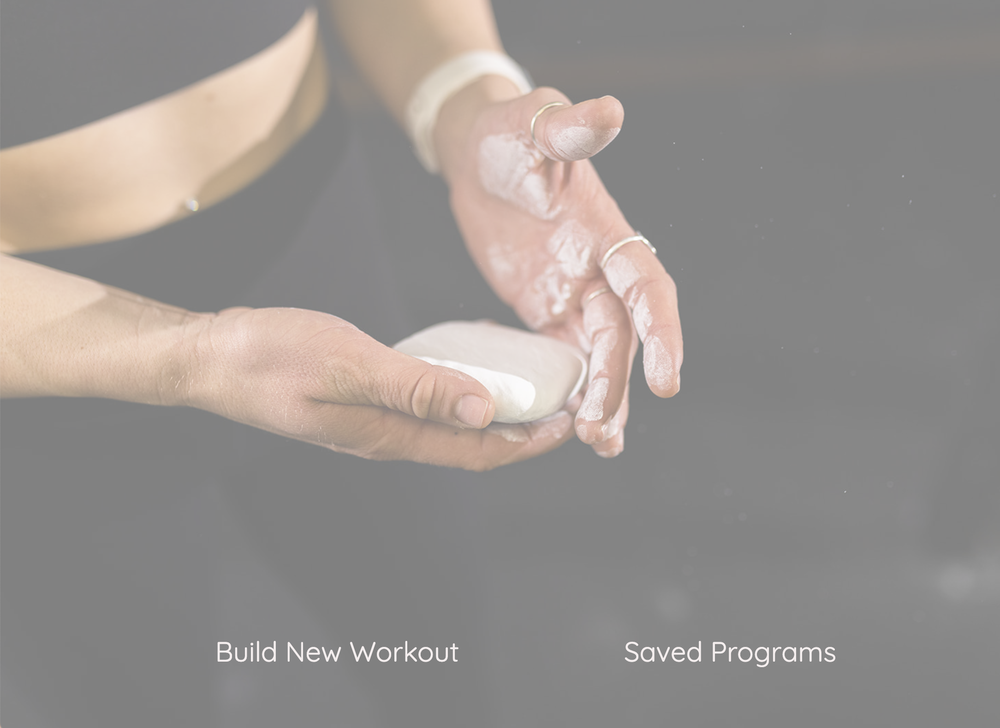
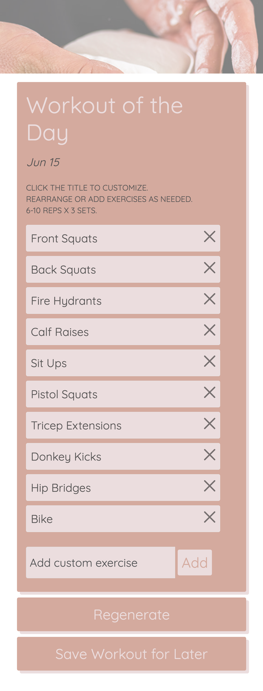

# workout-generator
This application will let the user create a workout as well as store past workouts for reuse. 

## Description
The application is designed to help the user build workouts and save them for later use. 

When the user opens the page they can either build a new workout or view saved workouts. If the user chooses to build one, they are given a randomized list of exercises with today's date and a workout title. The user can click the title of the workout to customize it which comes in handy if they wish to save the worout for later. The list of exercises can be sorted and specific exercises can be deleted. There is a text box at the bottom of the workout for the user to add custom exercises. The user can click the regenerate button to get a new list of exercises and reset the page. The user can choose to save that workout to local storage. 

If the user selects to see the saved workouts, the user is taken to a list of past workouts and is able to click on each one for reuse as long as localStorage allows. 

## Usage
This code can be customized with different exercises in the randomized array and new autocomplete options can be provided. This code is designed for mobile and desktop. Sortable currently works on desktop but drag and drop is not functional on mobile.

## Screenshots of Application 

Landing Page:

Build Workout Button:

Edit Workout: 

Saved Workout:

## Link to Deployed Application
https://mereljac.github.io/workout-generator/
